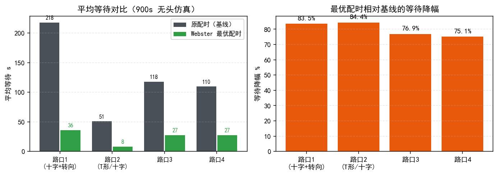

# 四典型路口最优调度方案（按现有算法）

> 对象：`桌面/赛题资料/路口仿真案例/` 中四个典型路口 SUMO 工程
> 方法：**平台方案一核心——Webster 最优配时**（饱和流法求关键流量比 Y → 最优周期 C₀ → 绿信比分配），
> 并以 900s 无头 SUMO 仿真验证（指标：平均等待 / 在网车辆 / 最大排队）。
> 复现脚本：`路口仿真案例/webster_opt_4isect.py`（保留在案例目录）；对比图 `docs/figs/fig4_intersections.png`。

## 0 方法与结论一览

- 四个案例均为**低-中饱和单点路口**（总进口流量 ≈1300–1700 veh/h），但原工程内嵌配时**周期过长（96–108 s）且绿时分配失衡**，导致平均等待高达 50–218 s；
- 按 Webster 重算的**短周期最优配时**（周期 ≈38–40 s）把四路口平均等待降低 **75–84%**、最大排队约减半：

| 路口 | 基线等待 s | 最优配时等待 s | 降幅 |
| --- | --- | --- | --- |
| 路口 1（十字+转向，6 相位） | 217.9 | 36.0 | 83% |
| 路口 2 | 50.8 | 7.9 | 84% |
| 路口 3 | 118.0 | 27.3 | 77% |
| 路口 4 | 109.6 | 27.3 | 75% |

> 说明：低饱和下 Webster 最优周期接近公式下限，实际取 25–45 s 区间内性能差异都很小；本表验证采用 40 s 周期便于直接替换。

## 1 路口 1（十字 + 多转向，J1，18 连接 / 6 相位）

**进口流量**（veh/h，来自 demo_1.flow.xml）：E0=430、-E1=366、-E2=425、-E3=462。

**原程序与建议配时**（黄灯相位不变）：

| 相位 | 服务方向（主要） | 原时长 s | 建议时长 s |
| --- | --- | --- | --- |
| 0 | -E2/-E3 直行组 | 42 | **10** |
| 1 | 黄灯 | 3 | 3 |
| 2 | -E1/E0 部分（含转向） | 15 | **10** |
| 3 | 黄灯 | 3 | 3 |
| 4 | -E1/E0 直行组 | 38 | **10** |
| 5 | 黄灯 | 3 | 3 |
| 周期 | — | 104 | **39** |

**验证**：等待 217.9 → 36.0 s；最大排队 19 → 8。
**分析**：原周期 104 s 在仅 ~1700 veh/h 下严重过长——绿灯大量空放，排队车需等完整长周期。短周期 + 合理绿时后车流快速清空。

## 2 路口 2（J1，6 连接 / 4 相位）

**进口流量**：-E1=368、-E2=322、E0=316。

| 相位 | 服务方向 | 原时长 s | 建议时长 s |
| --- | --- | --- | --- |
| 0 | -E1/-E2 | 48 | **22** |
| 1 | 黄 | 3 | 3 |
| 2 | E0 | 42 | **10** |
| 3 | 黄 | 3 | 3 |
| 周期 | — | 96 | **38** |

**验证**：等待 50.8 → 7.9 s；最大排队 9 → 3。

## 3 路口 3（J1，14 连接 / 4 相位）

**进口流量**：-E1=426、-E2=376、-E3=364、E0=473。

| 相位 | 服务方向 | 原时长 s | 建议时长 s |
| --- | --- | --- | --- |
| 0 | -E1/E0 | 55 | **12** |
| 1 | 黄 | 3 | 3 |
| 2 | -E2/-E3 | 47 | **20** |
| 3 | 黄 | 3 | 3 |
| 周期 | — | 108 | **38** |

**验证**：等待 118.0 → 27.3 s；最大排队 13 → 7。

## 4 路口 4（J1，12 连接 / 4 相位）

**进口流量**：-E1=316、-E2=349、-E3=327、E0=341（单车道进口，容量更紧）。

| 相位 | 服务方向 | 原时长 s | 建议时长 s |
| --- | --- | --- | --- |
| 0 | -E2/-E3 | 52 | **16** |
| 1 | 黄 | 3 | 3 |
| 2 | -E1/E0 | 49 | **16** |
| 3 | 黄 | 3 | 3 |
| 周期 | — | 107 | **38** |

**验证**：等待 109.6 → 27.3 s；最大排队 13 → 9。

## 5 为什么是"最优"：方法依据与注意事项

1. **Webster 公式**（经典单点配时）：按相位关键流量比
   `Y = Σ yᵢ`（yᵢ = 相位 i 服务进口流量/饱和流，饱和流取 1800 veh/h/车道），
   最优周期 `C₀ = (1.5L + 5)/(1 − Y)`（L=每相位损失，黄 3s+启动损失取 4s/相位），
   有效绿 `gᵢ = (C₀ − L)·yᵢ/Y`。本组流量低 → C₀ 落在公式下限附近（约 25–35 s），
   为避免过短（启动损失占比上升）验证取 40 s，绿时按 y 比例分配；
2. **适用范围**：上述配时为**该流量水平下的最优静态配时**；若车流变化（如高峰翻倍），
   短周期优势减弱、需重算——这正是平台**方案一（TOD 分时多套配时）与方案二（SCOOT/MAPPO 实时自适应）**
   存在的意义；
3. **接入平台的进阶做法**：
   - 将"建议相位时长"写入路网配套配时文件（timing*.add.xml 或直接改 net.xml tlLogic duration）→ 平台选**方案一**即按此运行；
   - 或平台选**方案二**（SCOOT 实时决策，参数 min_green≈8 / max_green≈30–45）→ 车流变化时自动调，无需人工重算；
   - 路口 1 相位 2/4 服务进口重叠、且含转向流量，接入方案二效果更稳（转向需求的动态性大）。