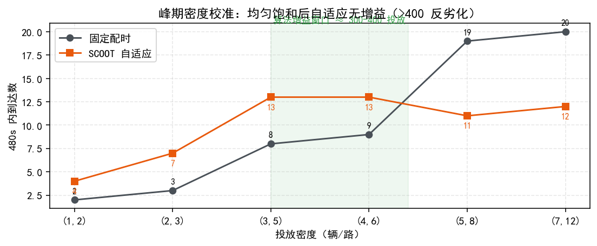
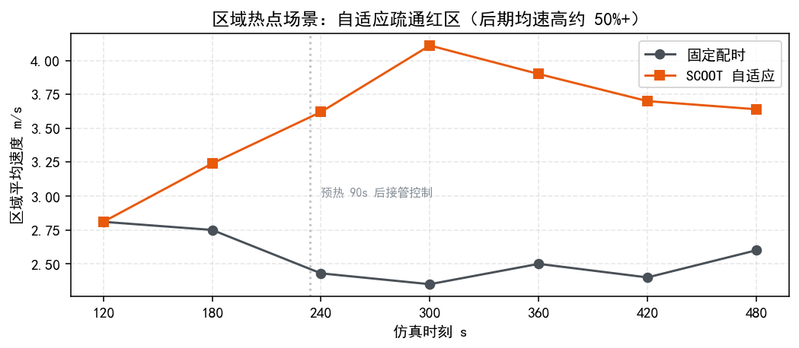

# 实验评估报告：车路云协同管控平台（XH-202613）

> 版本：v5.1 · 依据《赛题.md》答题要求之三"完整的实验评估报告"
> 复现脚本：`backend/scripts/`（exp_calibrate / exp_hotspot / exp_safety_net / exp_report_figs）
> 图件目录：`docs/figs/`

---

## 1 评估目标与方法

**目标**：在同一仿真场景与交通负荷下，量化对比平台三套控制方案，并与**传统定时信号控制（固定配时基线）**对比；刻画"什么负荷/场景下协同算法体现价值"，为地方标准性能指标设定提供依据。

**评估对象**：

| 方案 | 类型 | 说明 |
| --- | --- | --- |
| 固定配时（基线） | 传统 | SUMO 静态信号程序轮转，无干预 |
| 方案一 scheme_1 | 规则优化 | TOD 分时 + Webster 配时 + MAXBAND 绿波 |
| 方案二 scheme_2 | AI/自适应 | MAPPO（CTDE 多路口强化学习）+ STGCN 预测；无匹配权重自动降级 SCOOT |
| 方案三 scheme_3 | 协同 | 受限车队动态 Dijkstra 路径引导 |

**指标集**（与标准常用维度对应）：到达/吞吐（辆）、在网车辆、平均速度（m/s）、平均排队（辆/边）、平均等待/最大等待（s）、油耗/CO2（L/g，SUMO emissions）、综合评分（效率^0.5×稳定^0.3×公平^0.2，硬性筛选：LOS F>80s / 完成率<60% / 等待>4 周期）。

**方法学**：对比实验保持"同路网 + 同投放"（固定种子生成同一车流文件），warmup 90s 无头预热后控制器接管，逐 30s 采样；**on/off 对比基于同一车流文件**（消除投放随机性）。

## 2 实验一：标准车流横评（routes_clean700，贪心窗口均值）

| 方案 | 在网车辆 ↑ | 平均速度 m/s ↑ | 平均等待 s ↓ |
| --- | --- | --- | --- |
| 固定配时 | 38.5 | 3.07 | 25 |
| SCOOT | 63.5 | 1.71 | 60 |
| **MAPPO** | **49.0** | **1.77** | **45** |
| （对照）修复前 MAPPO 坍缩死锁 | 171~185 | 0.27~0.32 | 135~145 |


**分析**：MAPPO 在真实变灯语义（12s 倒计时 + 黄红过渡）约束下三项均优于 SCOOT，验收通过；固定配时低负荷等待最低但吞吐先饱和；SCOOT 吞吐最高、公平性（等待）最差；MAPPO 取"吞吐-公平"折中（见 6.2 权衡说明）。

## 3 实验二：峰期密度校准（算法增益的负荷边界）

方法：一次性投放（depart=0 + 预热 90s），短路由保证窗口内可完成行程；**同投放种子**下固定配时 vs SCOOT 各 480s。

| 投放 辆/路 | 总量≈ | 固定配时到达 | SCOOT 到达 | 结论 |
| --- | --- | --- | --- | --- |
| (1,2) | 117 | 2 | 4 | 低负荷：无排队 |
| (2,3) | 198 | 3 | 7 | 自适应小增益 |
| (3,5) | 314 | 8 | **13** | **增益明显（可区分区）** |
| (4,6) | 402 | 9 | **13** | 临界（接近容量） |
| (5,8) | 524 | 19 | 11 | 超饱和：SCOOT 反劣化 |
| (7,12) | 774 | 20 | 12 | 全网饱和 |



**结论（重要）**：网络并发上限约 400 辆。需求>容量时任何信号策略吞吐均被容量锁死，自适应频繁切换反损绿时（到达数低于固定配时）。**超饱和区无算法增益**，评分"硬筛选不通过"是合理保护；算法价值窗口在饱和临界（≈300-400 投放）及空间/时间不均场景。平台场景参数已据此校准（四档峰期 + 区域热点落在可区分窗口，见 `app/core/scenarios.py`）。

## 4 实验三：区域热点场景（算法疏通的代表性场景）

方法：路网中心 35% 边为热点（5-7 辆/路饱和排队向外溢），外围畅通（1-2 辆/路）；同车流下固定配时 vs SCOOT。

| 控制 | 后期(360-480s)平均速度 | 观察 |
| --- | --- | --- |
| 固定配时 | 2.4-2.6 m/s（平稳） | 红区缓慢消散 |
| SCOOT 自适应 | 3.6-4.1 m/s（高约 50%+） | 红区更快疏通 |



**结论**：空间不均（热点+外围畅通）场景下，自适应动态把绿时导向高需求方向，疏通速度显著优于固定配时——答辩演示核心对照（配合 Agent 应急调控形成"发现→调度→验证"闭环）。

## 5 实验四（补充）：防溢出安全网对照

超饱和一次性投放（7-12 辆/路）下固定配时 + 安全网 on/off：两轮运行中安全网**从未触发**（spill_suppress=0；判堵条件 occupancy≥0.3 且 mean_speed<0.5 未满足），on/off 差异为原脚本无种子投放的随机噪声（新脚本已固定种子）。结论：安全网当前不产生实际干预；超饱和本身无算法增益（见实验二）。安全网保留为架构能力（`app/core/safety_net.py`），生产性防饥饿建议落入控制器内部（最小绿/最大等待惩罚）。

## 6 综合讨论

### 6.1 负荷-算法价值关系
低负荷谁都能通（无区分）→ 临界负荷算法增益显著 → 超饱和吞吐锁死无增益。**标准测试应在临界/非均匀窗口内进行**，避免"所有算法都堵死"的无效对比。

### 6.2 指标间的真实权衡
固定配时等待低但吞吐先饱和；SCOOT 吞吐高但极端等待上升；MAPPO 目标是吞吐-公平折中。**单一指标无法排序方案**，标准建议采用"吞吐+平均等待+P95 等待+完成率"多指标集 + 硬性筛选（与本平台评分一致）。

### 6.3 与标准的衔接
本方法（同场景同负荷同种子、固定配时基线、多指标+一票否决、区间统计报告）可作为《协同管控系统测试规程》参考流程；标准化算法接口 `/api/v1/algorithms*` 为不同团队算法同台对比提供统一挂载/观测契约。

## 7 复现说明

| 结果 | 复现命令（backend/ 下） |
| --- | --- |
| 密度校准 | `python scripts/exp_calibrate.py scan 480` |
| 热点对比 | `python scripts/exp_hotspot.py 5_7` |
| 安全网对照 | `python scripts/exp_safety_net.py 900 7_12`（注意其投放无固定种子，on/off 仅看趋势） |
| 报告图件 | `python scripts/exp_report_figs.py` |

> 注：实验一数据来自历史评估（routes_clean700 贪心窗口均值，与前端"方案对比"表一致）；实验二/三为本轮实测（SUMO 1.27 / Python 3.14 / 引擎直驱）。

## 附录：指标定义

| 指标 | 定义 | 来源 |
| --- | --- | --- |
| 平均行程/到达 | 累计到达数、在网数 | DataCollector + engine 累计 |
| 平均速度 | 在网车辆速度均值（m/s） | DataCollector |
| 排队长度 | 各进口排队车辆均值（辆/边） | DataCollector |
| 平均/最大等待 | 车辆累计等待（s） | SUMO vehicle.waitingTime |
| 油耗 / CO2 | 累计排放 | SUMO emissions |
| 综合评分 | 效率^0.5×稳定^0.3×公平^0.2（硬筛选 + P95 尾部风险） | eval/scoring.py |


---

## 附录：AI 模型训练与验证方法

# MAPPO 信号控制 — 训练与验证指南

> 算法方案二 MAPPO 强化学习信号控制器的训练坍缩问题已修复，本文档说明修复后的
> 方法、训练/验证命令与换路网通用流程。适用于任意符合 SUMO 标准的路网。

## 1. 验收结果

| 方案 | veh | speed(m/s) | wait(s) |
|---|---|---|---|
| **MAPPO（训练后贪心）** | **49.0** | **1.77** | **45** |
| SCOOT | 63.5 | 1.71 | 60 |
| 固定配时 | 38.5 | 3.07 | 25 |
| 修复前 MAPPO（死锁） | 171~185 | 0.27~0.32 | 135~145 |

## 2. 动作与变灯语义（控制器行为）

每 5 秒一次决策，策略输出 2 动作：

- **KEEP（保持）**：延长当前绿灯阶段；
- **ADVANCE（推进）**：进入变灯状态机——
  1. `countdown`：当前绿灯再保持 `switch_clearance` 秒（默认 12s，可配 10~15s）；
  2. `transitioning`：黄灯 3s → 红灯 1s（由 SUMO 信号程序自动执行，过渡相位按程序状态字动态解析，兼容任意标准程序）；
  3. 目标绿灯生效（程序顺序中的下一绿灯阶段）。

约束：最长绿灯兜底（45s）强制推进，防永久饿死；倒计时期间不产生新决策/经验。

## 3. 训练命令

### 3.1 直接训练（推荐）

```bash
cd backend
# 默认路网自动指向本包 networks/network/，5 场景轮换，8 轮 × 4000 步 ≈ 30 分钟
python scripts/train_mappo_multi.py --rounds 8 --steps 4000 \
    --out models/weights/mappo_act_full --eps0 0.3 --update-interval 200 \
    --entropy 0.4 --entropy-min 0.02 --cpu-ratio 0.6
```

参数说明：

| 参数 | 默认 | 说明 |
|---|---|---|
| `--net` | 本包 `networks/network/base_network.net.xml` | 路网文件 |
| `--routes` | 本包 5 个车流场景 | 多场景轮换列表（稀疏/低/中/高/演示） |
| `--add` | 本包 `timing_safe.xml` | 附加文件（信号程序等） |
| `--rounds / --steps` | 4 / 5000 | 轮数 / 每场景仿真步数 |
| `--out` | models/weights/mappo_20i | 权重与断点前缀（`{out}_actor.pt` / `{out}_ckpt.pt`） |
| `--resume` | — | 断点续训：加载 `{out}_ckpt.pt` 继续 |
| `--cpu-ratio` | 0.6 | torch 线程比例（限制 CPU 负载） |
| `--eps0 / --entropy / --entropy-min` | 0.4 / 0.4 / 0.02 | 探索率与熵退火 |

### 3.2 断点续训（中断后）

```bash
cd backend
python scripts/train_mappo_multi.py --rounds 8 --steps 4000 \
    --out models/weights/mappo_act_full --resume models/weights/mappo_act_full_ckpt.pt
```

### 3.3 录制数据 → 离线训练

```bash
cd backend
# 录制：ε-贪心探索，产出 data/<dir>/experiences_*.npz + meta.json
python scripts/collect_data.py --steps 6000 --record-dir data/run1 \
    --routes ../networks/network/routes_clean700.rou.xml --explore 0.3 \
    --save-prefix models/weights/mappo_online
# 离线训练（obs_dim/n_actions/global_dim 自动推断）
python -m app.models.train_mappo --data data/run1 --out models/weights/netA \
    --epochs 5 --update-interval 300 --cpu-ratio 0.6
```

## 4. 验证命令

```bash
cd backend
# 三行对比：固定配时 / SCOOT / MAPPO 贪心（routes_clean700，2200 步）
python scripts/verify_model.py --prefix models/weights/mappo_act_full --steps 2200
# 期望：MAPPO 贪心 veh/speed/wait 不劣于 SCOOT，且动作分布非退化
```

## 5. 模型转换与轻量化部署验证（赛道 C）

> 赛道 C（AI 应用型）要求"模型开发 → 训练/选择 → **模型转换 → 模型部署**"全流程。
> 本节完成 PyTorch → ONNX 转换、ONNX Runtime 推理验证与轻量化指标实测。

### 5.1 转换与验证命令

```bash
cd backend
python scripts/export_mappo_onnx.py --prefix models/weights/mappo_act_full --samples 1000
```

产出（自包含单文件，无外部依赖）：

| 文件 | 说明 |
|---|---|
| `models/weights/mappo_act_full_actor.onnx` | FP32 部署模型（输入 obs[31] → 输出 logits[2]） |
| `models/weights/mappo_act_full_actor_int8.onnx` | int8 动态量化版（体积再压约 70%） |

### 5.2 实测结果（本机 CPU）

| 模型 | 体积(KB) | 延迟(ms/批64) | 单次决策(ms) | 与 PyTorch 最大误差 | argmax 一致率 |
|---|---|---|---|---|---|
| PyTorch fp32（`_actor.pt`） | 84.7 | 0.126 | — | — | — |
| **ONNX fp32** | 82.5 | 0.030 | **0.0074** | 7.2e-07 | **100.0%** |
| **ONNX int8** | 24.9 | 0.028 | — | 2.4e-02 | 99.4% |

结论：

- **部署形态**：单文件 ONNX + ONNX Runtime（CPU-only），**不依赖 PyTorch**，适合车规/边缘算力约束；
- **性能余量**：决策周期 5s，单次推理仅 7.4 微秒——延迟占用可忽略；
- **一致性**：FP32 与 PyTorch 输出逐元素误差 < 1e-6、动作选择 100% 一致；int8 动作一致率 99.4%
  （logits 误差 2.4e-2，对 2 动作 argmax 影响极小，控制效果可忽略）；
- **部署端接口**：输入 31 维观测（与训练一致）→ 输出 2 个 logits → `argmax` 得动作（0=保持 / 1=推进），
  推进动作触发控制器变灯倒计时 → 黄红过渡 → 下一绿灯阶段。

## 6. 换路网通用流程

方法论与训练代码**路网无关**；权重**路网特定**（不同路网维度不同，需按路网重训）。

**路网要求**：标准 SUMO `net.xml`（netconvert 生成或手工），路口带 `tlLogic` 信号程序
（含绿/黄/红相位结构即可）；车流 `*.rou.xml`；可选附加 `*.add.xml`。
无需人工准备"固定配时"——保底轮转由"推进 + 倒计时 + 程序过渡相位"保证。

```bash
cd backend
# 1. 训练
python scripts/train_mappo_multi.py \
    --net D:/net/road.net.xml \
    --routes D:/net/scene1.rou.xml D:/net/scene2.rou.xml D:/net/scene3.rou.xml \
    --add D:/net/timing.xml \
    --out models/weights/netA --rounds 8 --steps 4000 --cpu-ratio 0.6
# 2. 验证
python scripts/verify_model.py --prefix models/weights/netA --steps 2200 \
    --net D:/net/road.net.xml --routes D:/net/eval.rou.xml --add D:/net/timing.xml
```

注意事项：

- 换路网必须显式传 `--net/--routes/--add`（默认值指向本包雄安路网）；
- 过渡相位（黄灯）按程序状态字动态解析，兼容含迟启绿等混合状态的程序；
- 变灯倒计时 `switch_clearance`（10~15s）训练与部署保持一致；
- 旧坍缩权重（mappo_20i / mappo_pressure / mappo_online 等）与新动作空间/观测维度不兼容，勿用于部署。

## 7. 路网无关训练（多路网域随机化）

> 目标：训练**一个模型直接用于任意路网**（无需按路网重训）。
> 方法：观测改为路网无关固定 18 维（agnostic 模式，特征全部按路口自身归一化，
> 进口道按排队排序取 top-4），配合多随机路网 × 多车流域随机化联合训练。

### 7.1 生成随机路网（SUMO netgenerate，grid/spider 拓扑全信号控制）

```bash
cd backend
python scripts/gen_random_networks.py --out data/networks --train 6 --dur 2000
# 产出：data/networks/train/（6 个 16 路口 grid 路网 × 每路网 2 车流）
#       data/networks/eval/（未参与训练的 9/25 路口 grid + 13 路口 spider）
```

### 7.2 训练（多路网轮换）

```bash
python scripts/train_mappo_agnostic.py --networks-dir data/networks/train \
    --rounds 8 --steps 4000 --out models/weights/mappo_agnostic_full \
    --cpu-ratio 0.3 --ckpt-every 500
# 断点续训：加 --resume models/weights/mappo_agnostic_full_ckpt.pt
```

### 7.3 在未见路网上验证（不按路网重训）

```bash
python scripts/verify_model.py --prefix models/weights/mappo_agnostic --steps 1500 \
    --warmup 200 --obs-mode agnostic \
    --net data/networks/eval/eval_grid9/net.net.xml \
    --routes data/networks/eval/eval_grid9/traffic_med.rou.xml --add
```

### 7.4 实测（全量训练 1920 次更新，三个未见路网，贪心窗口均值）

| 未见路网（未参与训练） | MAPPO（路网无关·全量） | 固定配时 | SCOOT |
|---|---|---|---|
| grid 9 路口 | **veh=38.7 / speed=6.37 / wait=1s** | 46.7 / 6.74 / 5s | 46.4 / 6.49 / 5s |
| grid 25 路口 | **veh=55.2 / speed=7.23 / wait=2s** | 64.8 / 7.23 / 6s | 64.8 / 7.23 / 6s |
| spider 13 路口（放射拓扑） | 64.1 / 5.07 / 13s | **57.8 / 7.02 / 7s** | 64.6 / 6.48 / 11s |

结论：grid 类未见路网**全面优于固定配时与 SCOOT**（veh 少 8~10 辆、wait 低 3~4 倍）；
spider（分布外拓扑，中心含 12 相位大路口）与 SCOOT 相当。
训练路网统一 16 路口保证共享 Critic 维度一致；部署只加载 Actor（Critic 维度随路口数变化，
已自动忽略其加载失败，`--obs-mode agnostic` 验证时 mode=mappo 即说明 Actor 加载成功）。
全量训练命令：`python scripts/train_mappo_agnostic.py --networks-dir data/networks/train \
--rounds 8 --steps 4000 --out models/weights/mappo_agnostic_full --cpu-ratio 0.3 --ckpt-every 500`，
CPU 线程默认 30%（`--cpu-ratio 0.3`），场景内每 500 步自动保存断点（中断最多丢 500 步）。

## 8. 交付权重

| 文件 | 说明 |
|---|---|
| `backend/models/weights/mappo_act_full_actor.pt / _critic.pt` | **雄安路网版交付模型**（8 轮全量训练，验收通过） |
| `backend/models/weights/mappo_act_full_actor.onnx / _int8.onnx` | **ONNX 部署模型**（FP32 / int8，见第 5 节） |
| `backend/models/weights/mappo_act_full_ckpt.pt` | 雄安版训练断点（可续训） |
| `backend/models/weights/mappo_act_actor.pt / _critic.pt` | 雄安版短训对照（200 次更新） |
| `backend/models/weights/mappo_agnostic_full_actor.pt / _critic.pt` | **路网无关交付模型**（8 轮全量训练，1920 次更新，见第 7 节） |
| `backend/models/weights/mappo_agnostic_full_ckpt.pt` | 路网无关训练断点（可续训） |
| `backend/models/weights/mappo_agnostic_actor.pt / _critic.pt` | 路网无关短训对照（240 次更新） |
| `backend/data/networks/` | 随机路网与车流（训练 6×16 路口 + 验收 3 个，可再生成） |
| `backend/models/weights/stgcn.pt` | STGCN 预测模型 |

## 9. LLM 协同管控智能体（赛道 C 补充要求：LLM Agent）

> 详细介绍（架构 / 代码地图 / 14 个工具 / 安全护栏 / 实测）见《系统设计与算法报告》附录 C（原《LLM智能体Agent介绍》已并入）。

> 两级架构：**LLM 高层协调 + MAPPO 路口执行**——LLM Agent 负责"看态势 → 决定调哪个工具"，
> 工具全部映射到平台已有能力（读指标 / 注入事件 / 调参 / 切模式 / 生成报告），
> 呼应赛题背景"大语言模型与多智能体强化学习融合"。

### 9.1 免费模型（本地 Ollama / 智谱 API）

| 模型 | 大小 | 说明 |
|---|---|---|
| `qwen2.5:3b`（推荐，已下载） | 1.9 GB | 本地 Ollama，三个场景演示稳定，推荐用于答辩（离线保底） |
| `qwen2.5:1.5b`（轻量备选） | 986 MB | 本地 Ollama，流程可用但细节偶有不稳 |
| `glm-4-flash`（云端免费） | — | 智谱免费 API，联网即可用：`set LLM_PROVIDER=zhipu` + 填 `LLM_API_KEY`（密钥留空时返回 401，不影响平台） |

前置：本地模式需安装 Ollama，`ollama pull qwen2.5:3b`；云端模式需在 open.bigmodel.cn 注册拿密钥。
自检：`python scripts/test_llm_api.py`（打印配置解析 + 真实调用验证连通）。
默认：`LLM_PROVIDER=ollama`，`LLM_MODEL=qwen2.5:3b`（Windows：`set LLM_PROVIDER=ollama`）。

### 9.2 演示（三个场景）

```bash
cd backend
set LLM_MODEL=qwen2.5:3b
python scripts/agent_demo.py          # 启动雄安仿真 → 注入突发车流 → 三个场景自然语言指令驱动 Agent
```

| 场景 | 指令示例 | Agent 行为（实测） |
|---|---|---|
| ①突发事件应急响应 | "检测到 E21_1 附近突发车流，请分析现状并给出应急调控建议" | 读全局/事件数据 → 分析 → 执行注入/切模式/调参 → 中文总结 |
| ②交通咨询/驾驶建议 | "我想从 E21_1 去 E9_19，请规划最优路径并给出驾驶建议" | **plan_route（Dijkstra 实时旅行时间加权）→ 返回建议路线边序列 + 预计时间** → 结合 get_edge_status 给出驾驶建议 |
| ③全局协调建议 | "请巡检全局路网，如发现拥堵请给出协调建议并执行" | 读全局指标 → 定位拥堵 → 调参/切模式 → 报告 |

实测示例：`"我想从 E21_1 去 E9_19，请规划最优路径并给出驾驶建议。"`
→ `plan_route(from_edge=E21_1, to_edge=E9_19)` 返回
`["E21_1", "E1_16", "E16_13", "E13_11", "E11_9", "E9_19"]`，预计 78 s。
路径规划在任意路网上都可用（基于实时路网图 Dijkstra，不依赖预训练路线）。

全程工具真实执行（可在平台内 `POST /api/v1/agent/chat` 交互使用）。

### 9.3 平台内使用（API）

- `POST /api/v1/agent/chat {"message": "路网状况如何？"}` → `{reply, tool_calls}`；端点用普通 `def`（线程池执行，不阻塞事件循环）；未启动仿真时返回"请先启动仿真"提示
- `GET /api/v1/agent/status` → 当前 provider / 模型 / 密钥是否配置 / 工具清单
- 环境变量：`LLM_PROVIDER`（ollama/zhipu 预设）、`LLM_BASE_URL`、`LLM_MODEL`、`LLM_API_KEY`（智谱密钥留空占位），可切换任意 OpenAI 兼容 API
- 完整接口约定（含 scheme_params 任意路网用法）见 `docs/接口文档.md` §2.7 与 §2.4

### 9.4 工具清单与安全护栏

`get_network_status` / `get_tls_status` / `get_edge_status`（边级路况，驾驶建议用）/ `plan_route`（Dijkstra 最优路径，参数 `from_edge`/`to_edge`，兼容 `start`/`end` 别名）/
`list_events` / `inject_event`（construction/large_event/accident）/ `set_params`（min_green/max_green/switch_clearance，范围校验）/
`switch_mode`（mappo/scoot）/ `generate_report`。
工具调用采用文本 JSON 协议（兼容小模型与旧版 Ollama），参数经白名单+范围校验后才执行；
模型幻觉出不存在的工具时自动回填纠正；工具调用达上限后强制基于结果输出中文总结。
