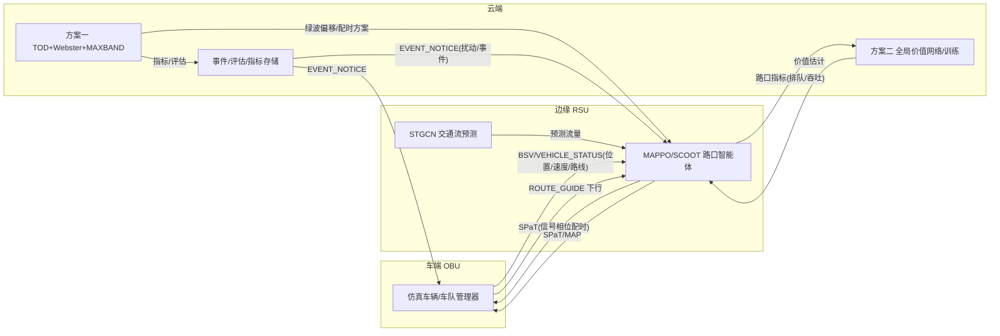

# 平台接口文档（REST + WebSocket）

> 版本：v5.1 · 对应《赛题》功能一·任务1（场景建模与数据接口设计）
> 后端服务：`http://127.0.0.1:8000`；接口前缀 `/api/v1`；WebSocket：`ws://127.0.0.1:8000/ws`
> 交互式文档：启动后端后访问 `http://127.0.0.1:8000/docs`（OpenAPI/Swagger UI）

---

## 1 通用约定

### 1.1 返回结构
所有 REST 接口统一返回 `application/json`：
```json
{ "code": 0, "message": "ok", "data": { } }
```
- `code == 0`：成功，结果在 `data`；
- `code != 0`：业务错误，`message` 为中文说明，`data` 为 `null`；
- 例外：`POST /report/generate` 直接返回文件流（下载）。

### 1.2 错误码
| 码 | 含义 |
| --- | --- |
| 0 | 成功 |
| 1001-1006 | 仿真：未启动 / 对象不存在 / 状态不允许 / 配置缺失 / 路网解析失败 / 连接失败（SUMO 未就绪） |
| 2001-2003 | 路网/报告：2001 格式不支持、2002 区间非法、2003 报告依赖缺失 |
| 3001 | 方案不存在 |
| 4001-4002 | WebSocket：格式错误 / 未知消息类型 |
| 5000 | 内部错误 |

### 1.3 工具导入（Apifox / Postman 模拟测试）
平台自带 OpenAPI 描述，可一键导入：
- URL：`http://127.0.0.1:8000/openapi.json`
- Apifox：「导入数据 → OpenAPI/Swagger → 粘贴 URL」；Postman：「Import → Link → 同上」。
- 无需鉴权头（智谱密钥仅存于后端 `.env`，不进入请求）。

---

## 2 仿真控制 `/simulate`

| 方法与路径 | 说明 |
| --- | --- |
| POST `/simulate/start` | 启动仿真（含场景/预热/方案参数） |
| POST `/simulate/stop` | 停止并完整复位（会话/路网/指标缓存全清） |
| POST `/simulate/pause` | 暂停（画布保留，不推步） |
| POST `/simulate/resume` | 恢复 |
| POST `/simulate/step` | 手动步进（暂停态）`{"steps":N}` |
| POST `/simulate/speed` | 倍速 `{"speed":1|2|5}` |
| GET `/simulate/status` | 状态 `{session_id,state,step,sim_time,scheme,vehicle_count,scenario,safety_net}` |
| GET `/simulate/scenarios` | 交通场景清单（sparse/normal/peak/extreme/hotspot） |
| POST `/simulate/right-turn-green` | 右转常绿开关 `{"enabled":bool}`（运行中实时生效） |

**POST /simulate/start 请求**
```json
{
  "net_path": "C:/.../networks/network/base_network.net.xml",
  "route_files": [], "add_files": [],
  "scheme": "scheme_2",
  "scheme_params": { "mode": "auto", "obs_mode": "agnostic",
                     "mappo_weights": "models/weights/mappo_agnostic_full",
                     "stgcn_weights": "models/weights/stgcn.pt" },
  "scenario": "hotspot",          // 可选：sparse / normal / peak / extreme / hotspot / none
  "right_turn_green": false,
  "end": 2000
}
```
**响应**
```json
{ "code": 0, "data": { "session_id": "a1b2c3d4",
  "status": { "state": "running", "step": 0, "vehicle_count": 248,
              "scenario": "hotspot", "safety_net": { "enabled": false } } } }
```

---

## 3 路网 `/networks`、`/network`

| 方法与路径 | 说明 |
| --- | --- |
| GET `/networks` | 可加载路网清单 `[{name,label,net_path,routes[],adds[]}]`（扫描 networks/network 与 data/networks/**） |
| GET `/networks/preview?name=` | 路网缩略预览 SVG |
| POST `/networks/upload` | 上传自定义路网：multipart `files`（.net.xml 必需 + 可选 .rou/.add/timing*.xml），存入 `data/networks/custom/<名>/` |
| GET `/network` | 当前路网 GeoJSON（前端画布数据源；edge→LineString 含 lanes/speed_limit/lane_shapes，node→Point 含 tls_id） |
| GET `/network/summary` | 摘要：edge_count / intersection_count / tls_count / total_lane_length_km / network_density |

---

## 4 指标 `/metrics`

| 方法与路径 | 说明 |
| --- | --- |
| GET `/metrics/realtime` | 全局 + 各路口实时指标（排队/等待/相位/吞吐） |
| GET `/metrics/history?metric=avg_speed&start=0&end=0&interval=10` | 历史序列（`end<=0` 表示到最新；支持 avg_speed/avg_delay/throughput/queue_length/fuel/co2） |
| GET `/metrics/edge/{edge_id}` | 单条边实时指标（点击道路详情） |
| GET `/metrics/spotlight` | 自定义指标聚合：完成率 / 累计出发到达 / 最久与最长等待车辆 / 最堵道路 / 最堵路口 |

**GET /metrics/spotlight 响应（节选）**
```json
{ "code": 0, "data": { "completion_rate": 0.42, "total_departed": 700, "total_arrived": 294,
  "longest_vehicle": { "id": "scv3", "duration": 412.0, "waiting_time": 88.0 },
  "most_congested_edge": { "id": "E12_8", "queue": 9, "mean_speed": 0.8 },
  "most_congested_tls": { "id": "7", "queue": 14, "waiting_time": 52.1 } } }
```

---

## 5 标准化算法接口 `/algorithms`（MCP-like）

> 云端的"算法插件契约"：新算法声明 参数/观测/指标/能力 后自动获得统一配置与观测面。

| 方法与路径 | 说明 |
| --- | --- |
| GET `/algorithms` | 算法清单 `[{id, kind(signal/vehicle), active, params}]` |
| GET `/algorithms/{id}` | 算法声明（schema：参数含范围/枚举、观测、指标、能力 + 当前值） |
| GET `/algorithms/{id}/state` | 运行状态：当前参数 + 统一观测快照（tls 排队/边流量/拥堵度…）+ 内部指标 |
| POST `/algorithms/{id}/config` | 设置参数（按声明校验，超范围/枚举拒绝） |
| POST `/algorithms/{id}/action` | 通用动作（switch_mode / enable_green_wave / reroute_fleet / add_restricted_zone…） |

**POST /algorithms/scheme_2/config 请求与响应**
```json
{ "params": { "mode": "scoot", "min_green": 8, "max_green": 45 } }
→ { "code": 0, "data": { "ok": true, "applied": ["mode","min_green","max_green"],
    "params": { "mode": "scoot", "min_green": 8.0, "max_green": 45.0, "switch_clearance": 12.0 } } }
```

---

## 6 方案（旧接口）`/schemes`

| 方法与路径 | 说明 |
| --- | --- |
| GET `/schemes` | 方案注册表清单 |
| GET `/schemes/{scheme_id}/status` | 方案运行状态 |
| POST `/schemes/{scheme_id}/config` | 动作（get_status / set_params / switch_tod_plan / reroute_fleet…） |

---

## 7 事件注入 `/events`

| 方法与路径 | 说明 |
| --- | --- |
| POST `/events/inject` | 注入扰动：accident（事故限速）/ construction（施工）/ large_event（突发车流） |
| GET `/events/list` | 事件列表（含受影响边） |

**POST /events/inject 请求**
```json
{ "event_type": "large_event",
  "params": { "edge_ids": ["E12_8"], "vehicles": 60, "veh_type": "DEFAULT_VEHTYPE" } }
```

---

## 8 车辆 `/vehicles`

| 方法与路径 | 说明 |
| --- | --- |
| GET `/vehicles/{veh_id}` | 车辆实时详情：位置/速度/车道/类型/路线/等待 + **驾驶建议 advice** |

**响应中 advice 字段示例（车端下行指令落地）**
```json
{ "current_kmh": 41.0, "suggested_kmh": 45.0, "state": "畅通",
  "reason": "当前限速 50.0 km/h；下游 E26_4:畅通，建议按 90% 限速平稳行驶以节能省停",
  "next_edges": ["E26_4"], "suggested_mps": 12.5 }
```

---

## 9 测试车辆 `/test-vehicle`

| 方法与路径 | 说明 |
| --- | --- |
| POST `/test-vehicle/start` | 启动测试单车 `{from_edge,to_edge,via[]}` |
| GET `/test-vehicle/status` | 单车行驶状态与分边等待统计（演示"点击选路"用） |

---

## 10 评分与报告

| 方法与路径 | 说明 |
| --- | --- |
| GET `/evaluate/score` | 综合评分（效率^0.5×稳定^0.3×公平^0.2，实时近似；硬性筛选不通过时 passed=false + reasons） |
| POST `/report/generate` | 生成评估报告并下载（文件流） |

**POST /report/generate 请求**
```json
{ "format": "md",            // md | docx | pdf
  "start": 0, "end": 600,    // 模拟秒区间；end=0 表示截至当前
  "sections": ["overview","score","history","intersections","charts","events"] }
```

---

## 11 LLM 智能体 `/agent`

| 方法与路径 | 说明 |
| --- | --- |
| POST `/agent/chat` | 自然语言指令；Agent 自动多步调用工具（上限 8 步，文本 JSON 协议） |
| GET `/agent/status` | provider / 当前模型 / 可选模型 / 工具数 / max_steps |
| POST `/agent/model` | 运行时切换模型 `{"model":"glm-4-flash"}`（仅限免费可选清单） |
| GET `/agent/tools` | 全部工具（技能）清单：名称 / 描述 / 参数（必填/枚举/范围） |
| POST `/agent/reset` | 清空会话记忆与调控对比基线 |

**POST /agent/chat 响应**
```json
{ "code": 0, "data": { "reply": "已将最长绿灯调至 40s，平均速度由 1.1 提升到 1.6 m/s。",
  "tool_calls": [ { "tool": "compare_metrics", "args": { "action": "set" }, "result": { "ok": true } },
                  { "tool": "configure_algorithm", "args": { "algorithm_id": "scheme_2",
                    "params": { "max_green": 40 } }, "result": { "ok": true } },
                  { "tool": "compare_metrics", "args": { "action": "compare" }, "result": { "ok": true } } ] } }
```

---

## 12 WebSocket 实时协议 `/ws`

后端启动后即可连接；服务端按仿真步主动推送：

| type | 触发 | data 要点 |
| --- | --- | --- |
| `simulation_step` | 每步 | step / simulation_time / vehicle_count / avg_speed |
| `vehicle_update` | 每步 | added[] / updated[]（x,y,angle,speed,lane,type）/ removed[] |
| `tls_update` | 信号变化 | `{tls_id:{state_str, phase_index, links:[{from_edge,from_lane,dir}]}}`（dir：s/l/r/t） |
| `metrics_update` | 每 60 步 | overall（均速/等待/排队/吞吐）/ intersections（排队/等待/相位/通过） |
| `simulation_event` | 事件/提示 | event_type / message / details |

客户端可发送：`{"type":"set_speed","data":{"speed":2}}`、`pause`、`resume`、`stop`、`step`。

---

## 13 关键调用时序

```
[启动一次场景演示]
用户点"启动仿真"（hotspot 场景）
  POST /simulate/start → 后端解析路网 → 按场景生成一次性投放车流 → SUMO 预热 90s → 推步线程
  前端：GET /network 画路网 → 订阅 /ws
  每步 WS vehicle_update（车辆）+ tls_update（信号灯）
  每 60 步 WS metrics_update → 底部速度曲线/综合评分
[AI 应急调控]
  POST /agent/chat "东侧拥堵请调整最长绿灯"
    → Agent：compare_metrics(set) 记基线
            → configure_algorithm(scheme_2, max_green=40)
            → compare_metrics(compare) → 输出前后差异 → 中文总结
[导出报告]
  POST /report/generate {format:"docx", start, end} → 文件下载
```

---

## 14 算法能力对照速查

| /algorithms id | kind | 主要参数（config） | 主要动作（action） |
| --- | --- | --- | --- |
| scheme_1 | signal | green_wave(bool)、recalc_interval(60-900) | switch_tod_plan / enable_green_wave / add_corridor / recalculate |
| scheme_2 | signal | mode(auto/mappo/scoot)、min_green(0-20)、max_green(15-90)、switch_clearance(5-20) | switch_mode / train_step / save_model / load_model / get_predictions |
| scheme_3 | vehicle | auto_reroute(bool)、cooldown(0-600) | reroute_fleet / register_fleet / add_restricted_zone / get_congestion_map |


---

## 15 云-边-端架构与实现落点（并入自《云边端架构》）

# 云-边-端协同架构与数据流

## 1. 三层架构

> 前端为本项目自研渲染（Canvas 自绘路网 + ECharts 指标），非第三方地图框架。

```
┌──────────────────────────────────────────────────────────────┐
│ 前端展示层（Vue3 + Canvas 自绘 + ECharts + WebSocket）         │
│  REST API /api/v1  +  WebSocket 实时推送（车辆/信号灯/指标）   │
└───────────────┬──────────────────────────┬───────────────────┘
                │ REST                     │ WebSocket
┌───────────────▼──────────────────────────▼───────────────────┐
│ 云端 · 集中决策中枢（FastAPI 服务层 AppRuntime）               │
│  - 方案一：TOD 调度 / Webster 集中配时 / MAXBAND 全局绿波       │
│  - 方案二：全局状态聚合、MAPPO 训练/全局价值、STGCN 全局预测     │
│  - LLM 智能体（态势感知→跨区调度指令，走算法配置接口）          │
│  - 全局指标统计、评分评估、历史存储、报告导出、事件全局通告      │
└───────────────┬──────────────────────────────────────────────┘
                │ V2X 通信模拟（消息 + 延迟/丢包，传输层可替换）
┌───────────────▼──────────────────────────────────────────────┐
│ 边缘 · RSU 路口智能体（仿真内嵌，每路口一个，本地观测→本地动作） │
│  - 方案一：Webster 各路口本地流量采集与重算                    │
│  - 方案二：SCOOT 本地自适应（降级） / MAPPO 路口策略（分布执行）│
│  - STGCN 短时交通流预测（路口/边级）                           │
│  - conflict.py 本地冲突/安全校验（防溢出、右转常绿等路侧逻辑）   │
└───────────────┬──────────────────────────────────────────────┘
                │ V2X 通信模拟
┌───────────────▼──────────────────────────────────────────────┐
│ 车端 · OBU（仿真车辆 / 车队管理器）                            │
│  - 方案三：车队识别、动态路线引导（Dijkstra + K短路 + 负载均衡）│
│  - 节能/通行驾驶建议（建议车速、前方拥塞提示）                 │
│  - 车辆状态上报（位置/速度/路线）上行                          │
│  - 接收下行指令（路线变更/建议车速/信号配时预告）               │
└───────────────┬──────────────────────────────────────────────┘
                │ TraCI（独立线程）
┌───────────────▼──────────────────────────────────────────────┐
│ 仿真引擎层 SUMO ≥1.18（20 路口 窄路密网格网 路网）             │
└──────────────────────────────────────────────────────────────┘
```

## 2. 车-路-云数据流



## 3. V2X 消息类型

| 类型 | 方向 | 内容 |
|---|---|---|
| BSV | 车→边/云 | 基本安全（位置/速度/方向） |
| VEHICLE_STATUS | 车→云 | 车辆状态上报 |
| SPaT | 边→车 | 信号相位与配时 |
| MAP | 边→车 | 路口拓扑 |
| ROUTE_GUIDE | 云→车 | 路线引导指令 |
| EVENT_NOTICE | 云→边/车 | 事件通告 |

通信经 `app/comms`（V2XHub + SimulatedTransport）模拟延迟/丢包；传输层抽象为 `Transport` 接口，可替换为 SocketTransport（真多机）。

## 4. 实现落点（代码映射）

| 架构角色 | 本仓库实现 | 关键文件 / 接口 |
| --- | --- | --- |
| 云端 · 决策/数据中枢 | FastAPI `AppRuntime`（全局状态、评分、历史、报告、事件、LLM） | `app/core/runtime.py`、`app/api/*`、`app/eval/scoring.py`、`app/report/` |
| 云端 · 算法配置面 | 标准化算法接口（统一挂载/观测/参数） | `GET/POST /api/v1/algorithms*`、`app/algorithms/` |
| 云端 · 高层协调 | LLM 智能体（态势→跨区调度，调 configure_algorithm/action） | `app/agent/` |
| 边缘 · 路口智能体 | 方案一/方案二控制器（每路口本地决策） | `app/schemes/scheme1/`、`scheme2/` |
| 边缘 · 安全/冲突 | 路侧本地校验（右转常绿、防溢出安全网） | `app/core/conflict.py`、`safety_net.py`、`right_turn_link_indices` |
| 边缘 · 预测 | STGCN 短时流量预测（无权重时 EWMA 规则兜底） | `app/schemes/scheme2/stgcn.py` |
| 车端 · 引导/建议 | 方案三车队动态重路由 + 车辆驾驶/节能建议 | `app/schemes/scheme3/`、`GET /vehicles/{id}/advice` |
| V2X 通信 | 消息（BSV/SPaT/MAP/VEHICLE_STATUS/ROUTE_GUIDE/EVENT_NOTICE）+ 传输抽象 | `app/comms/` |

**部署约束假设**（对应赛题"现有车规级芯片算力与通信带宽约束"）：
- 云端重决策低频（TOD/绿波/事件级，秒~分钟级）；边缘（RSU/路口）中频（秒级，SCOOT/MAPPO 5s 决策周期）；车端高频（车辆步进由 SUMO 驱动）。
- 上行仅状态摘要（位置/速度/排队聚合），下行仅指令（配时/路线/建议车速），不传全量轨迹 → 通信带宽需求低。
- 模型轻量化：MAPPO Actor 仅 2 层 MLP（ONNX/int8 导出），STGCN 图卷积小网络，均可在 CPU/车规级推理。

## 5. 标准化接口价值

云-边-车接口与消息格式经本架构固化（含上面的实现落点映射），可作为《协同管控系统测试规程》地方标准的接口规范参考。
